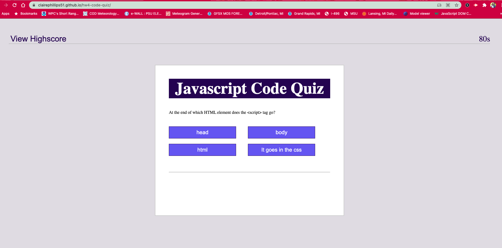
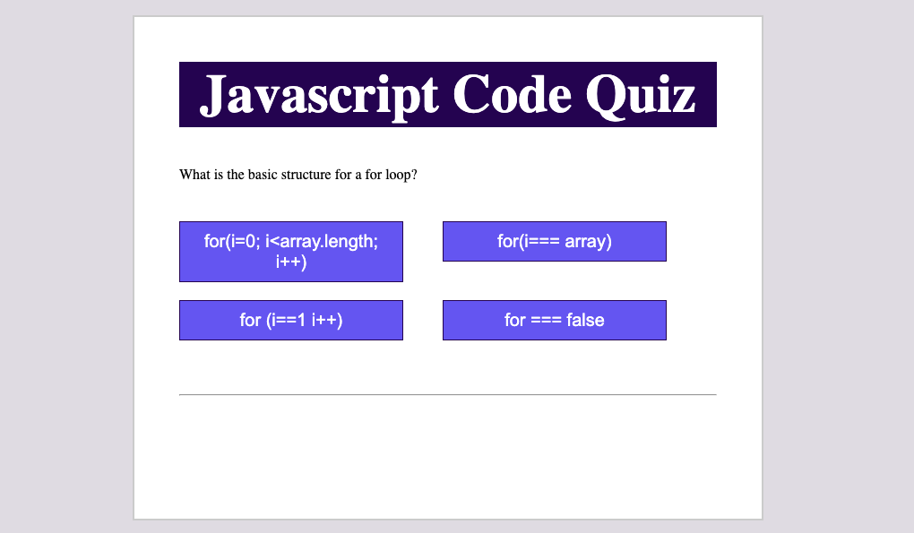
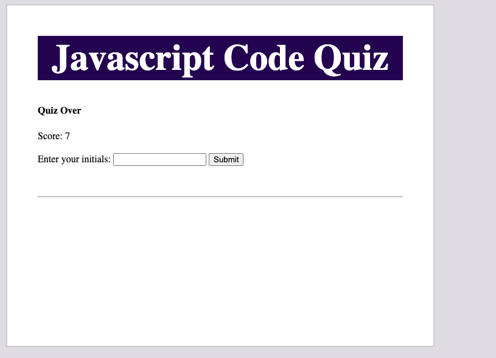
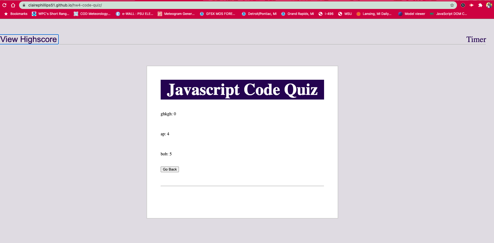

# hw4-code-quiz

# Javascript Code Quiz
Link: [Javascript Quiz](https://clairephillips51.github.io/hw4-code-quiz/)

## Summary
Creating a functional multiple choice quiz from scratch using html, css, and javascript. At the end of the quiz you recieve your score and can input you initials and sumbit them to the highscore board. 

## Table of Contents
1. [Usage](#usage)
2. [What I Learned](#what-i-learned)
3. [Resources](#resources)

## Usage
When you load the page you have a highscore button at top left of the page and a timer at the top right of the page. In the middle is the white box where the quiz takes place. When you click the start button the quiz begins.

 
 The quiz is multiple choice and once you select your answer: "Correct!" or "Wrong!" will flash quickly below the answer buttons. After you answer the first question it will move on to the second question and so on until you either answer all the questions or the timer runs out. There are only 7 questions and 90 seconds to answer them all. If you answer incorrectly a penelty of 5 seconds will be taken off the timer. When you answer correctly no extra time is subtracted and you gain one point. 

 

At the end of the quiz a form will appear that says "Quiz over" below that it will show you your score(i.e. how many you questions answered correctly) and ask you to input your initials. 

After you click submit it will take you back to the start of the quiz. At the top right of the page is the highscore button. Clicking that will take you to the highscore list. There you will find the list of scores with the initials of the person who recieved that score. This is also tied to local storage so if you take the quiz again and get a different score your first score will still be in the higscore list. 

## What I Learned
The html and css at first seems fairly basic. The html consits of  a header where the highscore and timer are located and then 4 main `
`s that hold the quiz, the end screen, the highscore screen, and a footer that says whether the answer was right or wrong. 

For the css I based my file off of the css from the website in the screen shot below.

This helped me get started with the javascript which consisted of an array for the questions and then a multitude of functions to get the quiz to flow as decribed above. There are also event-listeneres for every button. 

The most difficult thing was getting the quiz to automatically move on to the next question after you selected your answer. In this function I had to index my array for the questions, while also setting event-listners for the multiple choice buttons. Then an if else stament was added to the event listner to determine whether or not that answer was right and which word would flash ("correct" or "wrong") under the question and then move on. 

## Resources
* [jQuery API Documentation](https://api.jquery.com/)
* [W3schools HTML input and form](https://www.w3schools.com/tags/tag_input.asp)
* [Css format I based my quiz off of](https://webdevtrick.com/create-javascript-quiz-program/)
* [jQuery CDN](https://code.jquery.com/) 
* [Javascript & jQuery book by Jon Duckett](https://www.amazon.com/gp/product/1118531647/ref=ppx_yo_dt_b_asin_title_o00_s00?ie=UTF8&psc=1)
